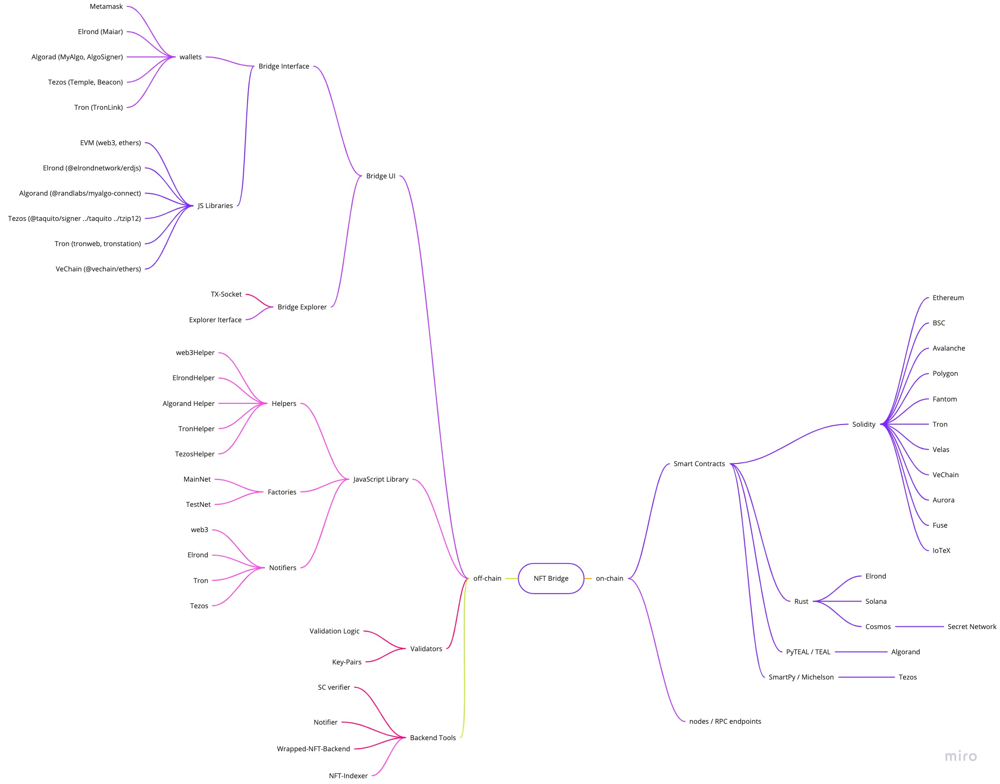
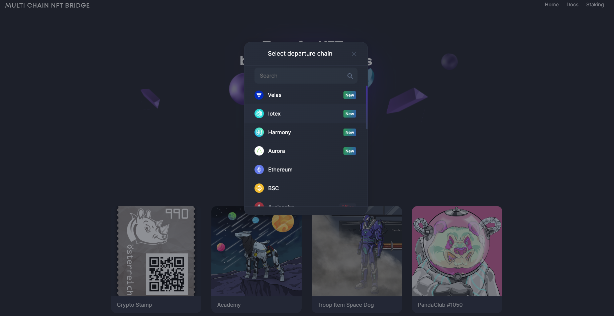
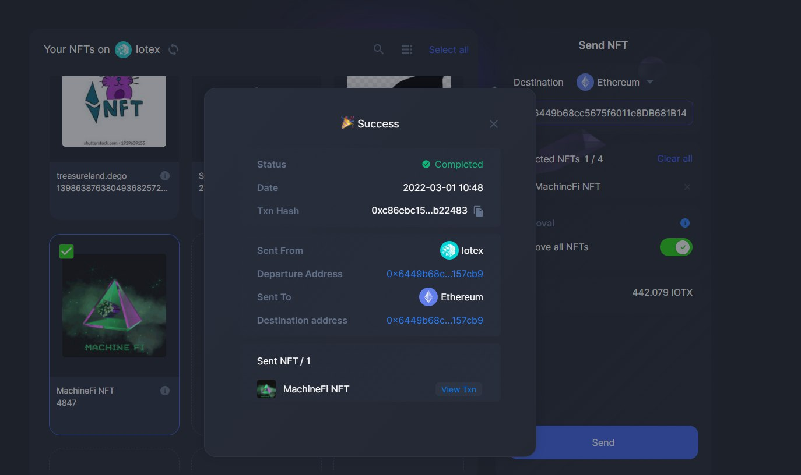
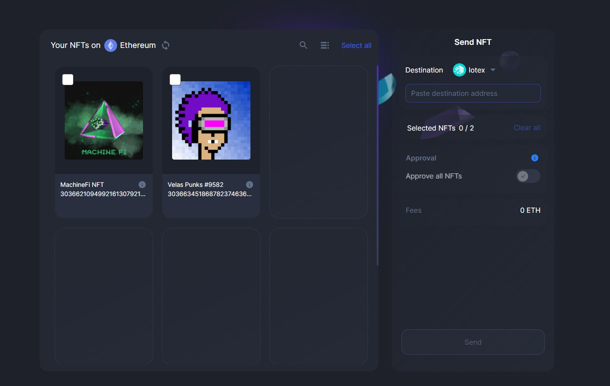

# IoTeX Grant Documentation

## 1. Bridge Architecture Overview

- The first of the kind [NFT multi-chain bridge](https://bridge.xp.network/) connecting a wide range of EVM to a number of Non-EVM chains. The bridge allows transferring NFTs to and from:
  - Ethereum
  - Binance Smart Chain
  - Avalanche
  - Polygon
  - Algorand
  - Fantom
  - Tron
  - Tezos
  - Elrond
  - Gnosis Chain (former xDai)
  - Harmony
  - Aurora
  - Fuse

### 1.1 Tech stack

| Bridge Component | Stack |
| :-: | :-: |
| Smart Contracts | Solidity, Rust, TEAL, Michelson |
| Validators (Oracles) | TypeScript |
| Backend | TypeScript |
| Frontend | React (JSX, TypeScript) |

### 1.2. Bridge Architecture


### 2.2 Frontend

1. Initial View of the Bridge

   
2. Departure / Destination chain list



### 2.3 Backend + Token Conversion Oracles

1. Nft-Index (Returns a list of NFTs an account owns on a supported blockchain)
2. Transaction Fee Estimator - provides the TX fee on the target chain
3. Crypto-Currency Converter (Oracle) converts the target fee to the native tokens of the original chain via USDT equivalent.

### 2.4 Relay Validators (Oracles)
1. Private (SK) & Public (PK) key pairs for all the connected chains
2. Validation logic
   1. Chain Event catching
   2. Event deserialization
   3. Transaction composition
   4. Transaction submition to the target chain
3. Velas Node 
   1. able to accept transactions
   2. Deliver events to the validators

## 3. Milestone Deliverables

| Number | Deliverable | Specification |
|-|-|-|
| 3.1 | Documentation | We will provide both inline documentation of the code and a basic tutorial that can interact with the deployed smart contracts and backend service. |
| 3.2 | Smart Contracts | We have developed smart contracts that are able to:<br>1. Support ERC-721 `0x81e1Fdad0658b69914801aBaDA7Aa0Abb31653E5`<br>2. Support ERC-1155 `0xD87755CCeaab0edb28b3f0CD7D6405E1bB827B65`<br>3. Bridge SC `0x4bA4ADdc803B04b71412439712cB1911103380D6`<br> 4. Freeze/Unfreeze Native NFTs in batches<br>5. Mint/Burn wrapped NFTs in batches<br>6. Pay the TX fees on the target chain in native tokens<br>7. Send / Receive NFTs in batches<br>8. Withdraw TX fees in the native tokens for the target chain |
| 3.3 | Backend | Integration of Velas in the:<br>1. [NFT Index](https://indexnft.herokuapp.com) Requires JWT<br>2. TX Fee Estimator<br>3. [Crypto-currency converter](https://testing-bridge.xp.network/exchange/)<br> 4. [Heartbeat](https://xpheartbeat.herokuapp.com) - checks whether the Velas Node & validators areup and operating properly |
| 3.4 | Frontend | Integration of Velas in the:<br>1. User Interface<br> 2. Wallets (Metamask, TrustWallet, WalletConnect) |


## Testnet Smart contracts
|Contract|Address|
|:-:|:-:|
|UserNftMinter|0x90d38996B210D45bDF2FD54d091C6061dff0dA9F|
|Erc1155Minter|0xE90105827d04522e52AdfA6BF695730E5706C0C2|
|XPNft1155|0x46Df0d0Dd629d61BDFA567dE61912FDeD883A60d|
|XPNft|0x33DC209D33AddF60cf90Dd4B10f9a198A1A93f63|
|Minter|0x04a5f9158829Cae5a0a549954AdEaBD47BbB3d2d|

## 4. Future Plans

Our long term plans include:
1. Running a Velas Node for listening to the chain events and submitting bridge transactions
2. Mainnet integration to Cardano, Solana, Polkadot ecosystem, Cosmos ecosystem, EOS compatible chains, NEO
3. ERC-721A New smart contract support (allows minting and burning in batches)
4. Forged NFT detection on all the bridged chains
5. NFT explorer for finding NFT’s with deleted storage
6. NFT meta backup to secure transactions
7. Distributed NFT’s hosting (better than IPFS)
8. NFT Search (search by any parameter)
9. Retention protection tool

## 5. Successful Mainnet NFT Transfers

Sending from IoTeX to Ethereum:<br/>
https://iotexscan.io/tx/0xc86ebc1508516e05dc9306b69ccd28ba2994c9439e8ee961b6aaf47f8bb22483?format=0x



IoTeX NFT on Ethereum in OpenSea:<br/>
https://opensea.io/assets/0xc254a8d4ef5f825fd31561bdc69551ed2b8db134/30366210949921613079214926160



## 6. Trying IoTeX in Testnet

### 6.1. Initiating a Node.js project
Initiate a JS/TS project

```bash
mkdir your_project
cd your_project/
yarn init -y
```

### 6.2. Installing the libraries

To test/use the latest commits of the library install directly from github

```bash
yarn add "git+https://github.com/xp-network/xpjs#bleeding-edge" @elrondnetwork/erdjs ethers @taquito/taquito @temple-wallet/dapp dotenv
```

### 6.3. Importing the Dependencies

```ts
import {
    ChainFactoryConfigs,  ChainFactory,
    ElrondHelper,         ElrondParams,
    TronHelper,           TronParams,
    Web3Helper,           Web3Params,
    AppConfigs,
    NftMintArgs,          Chain
} from "xp.network";
import {config} from 'dotenv';
config();
  
// Instantiate the chain factory for the TESTNET
const testnetConfig = ChainFactoryConfigs.TestNet();
const factory = ChainFactory(AppConfigs.TestNet(), testnetConfig);
```

### 6.4. Creating a signer object

Add a `.env` file and populate it with the Private Key of the signer

```bash
touch .env
echo "SK=<replace with your Provate Key>" >> .env
```
Add the signer object:
```ts
// EVM chains compatible wallet:
import { Wallet } from "ethers";
// EVM signer for testing in the BE
const signer = new Wallet(
  //  Private Key Of the Signer
  process.env.SK!,
  testnetConfig.iotexParams?.provider
);
// Print out your signer object to see that it matches the expected wallet
console.log("signer", signer);
```

### 6.5. Creating inner Blockchain objects

```ts
(async () => {
  
  // Inner Object ============= Chain Nonce == Chain Nonce ==
  // IOTEX:
  const iotex     = await factory.inner<20>(Chain.IOTEX);
  // Other EVM-compatible chains:
  const bsc       = await factory.inner<4>(Chain.BSC);
  const ethereum  = await factory.inner<5>(Chain.ETHEREUM);
  const avax      = await factory.inner<6>(Chain.AVALANCHE);
  const polygon   = await factory.inner<7>(Chain.POLYGON);
  const fantom    = await factory.inner<8>(Chain.FANTOM);
  const velas     = await factory.inner<19>(Chain.VELAS);
  const gnosis    = await factory.inner<14>(Chain.XDAI);
  const harmony   = await factory.inner<12>(Chain.HARMONY);
  // Non-EVM chains:
  const tron      = await factory.inner<9>(Chain.TRON);
  const elrond    = await factory.inner<2>(Chain.ELROND);
  const avalanche = await factory.inner<15>(Chain.ALGORAND);
  const tezos     = await factory.inner<18>(Chain.TEZOS);
  // To view an inner object:
  console.log("iotex:", iotex);
})();
```

### 6.6. Minting NFTs for testing

```ts
(async () => {
   const nftResult = await factory.mint(
      iotex,
      rocess.env.SK!,
      {
        contract: "0x90d38996B210D45bDF2FD54d091C6061dff0dA9F",
        uris:["<Replace with your metadata URI>"]
      } as NftMintArgs
   );
   console.log("Minting result:", nftResult);
})();
```

### 6.7. Getting a list of NFTs a user owns on a Blockchain

```ts
(async () => {
  // Getting a list of NFTs
  const iotexNFTs = await factory.nftList(
    velas,            // The inner chain object
    signer.address  // The public key of the user
  );
  // To view a list of NFTs:
  console.log("NFTs:", iotexNFTs);
})();
```

### 6.8. Transferring an NFT
```ts
(async () => {
    // Calling the function:
    const web3Result = await factory.transferNft(
    iotex,                      // The Source Chain.
    ethereum,                   // The Destination Chain.
    bscNFTs[0],                 // The NFT selected by the index.
    signer,                     // The web3 signer object.
    "ADDRESS OF THE RECEIVER"   // The address who you are transferring the NFT to.
  );
  console.log(web3Result);
})();
```